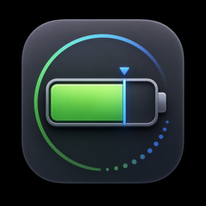

# Battery Limiter

A menu bar app for Apple Silicon Macs that stops charging at 80/85/90/95%, so
a Mac that lives on AC power doesn't sit pinned at 100% all day. Lithium-ion
cells age faster the more time they spend near a full charge, and this is the
simplest lever on that.

> **Read this before installing.** macOS has no public API for capping charge.
> This does what AlDente and BatFi do: it writes *undocumented* SMC (System
> Management Controller) keys from a small root daemon. Apple can change or
> remove those keys in any macOS update — it has happened before, silently.
> The app is also unsigned (no paid Developer account). If either of those is
> a problem for you, don't install it. Nothing here is destructive and there's
> a documented [recovery path](#if-charging-gets-stuck), but you should know
> what you're running.

## Requirements

- Apple Silicon Mac (M1 or later). No Intel support.
- macOS 13 or later. Verified on macOS 14.5; see [Limitations](#limitations)
  for a known breakage on 15.5+.

## Install

Download the `.zip` from the
[latest release](https://github.com/MlayKlayer/battery-limiter/releases/latest),
unzip it, and drag `BatteryLimiter.app` to your Applications folder.

Then unblock it once — macOS quarantines anything downloaded from the web, and
this app isn't notarized (see [why](#why-the-unblock-step)):

```sh
xattr -dr com.apple.quarantine /Applications/BatteryLimiter.app
```

Prefer not to use Terminal? Double-click the app, let macOS refuse, then open
**System Settings → Privacy & Security**, scroll down, and click **Open
Anyway**. Same result.

Now launch it. An outlined percentage appears in your menu bar. Then:

1. Turn on **Limit Charging** and pick a percentage. macOS asks for your admin
   password **once** — that installs the helper daemon. Approve it.
2. Optionally set **Resume at** (see [The charge band](#the-charge-band)) and
   **Launch at Login**.

After that first prompt, changing the limit never prompts again.

### Upgrading from an earlier version

Replacing the app does **not** replace the root daemon — the installer skips
itself whenever the daemon is already present, so the old one keeps running.
Since most of what the app does lives in that daemon, an upgrade looks applied
while behaving like the version you replaced. After dragging in a new
`BatteryLimiter.app`:

1. **Remove Helper…** in the menu.
2. Turn **Limit Charging** back on, and approve the admin prompt.

Your settings are kept — they live in
`/Library/Application Support/BatteryLimiter/config.json`, which this doesn't
touch.

### Why the unblock step

Apple only lets an app launch cleanly from the internet if it's **notarized**,
which requires a paid Apple Developer account ($99/year). This project doesn't
have one, so the app is ad-hoc signed and macOS treats it as unidentified.

The unblock is a one-time action and it doesn't weaken anything system-wide —
it clears the quarantine flag on this app only. But you are, correctly, being
asked to extend trust to a binary from the internet that installs a **root
daemon**. If you'd rather not, build it yourself instead; the source is right
here and it's the same result.

### Build from source

```sh
git clone https://github.com/MlayKlayer/battery-limiter.git
cd battery-limiter
./Scripts/install.sh
```

Builds the app, copies it to `/Applications`, and launches it. Needs Xcode or
the Command Line Tools (`xcode-select --install`). Nothing quarantines a
locally built app, so there's no unblock step on this path.

## Usage

The menu bar shows **your cap, not the current charge** — macOS already
displays the live percentage, and a second live number next to it just reads
as something urgent. By default it's drawn as hollow outlined digits so it
looks like the static threshold it is — **Style** and **Color** change that,
and combine freely. Whichever you pick fades to semi-transparent whenever
**Limit Charging** is switched off.

Leaving **Color** on Automatic keeps the readout adaptive: macOS draws it as a
template image and tints it to match a light or dark menu bar. Choosing an
explicit colour opts out of that, so it stays that colour in both.

The menu itself shows the current state and gives you:

| Control | What it does |
|---|---|
| **Limit Charging** | Master on/off. |
| **Limit to** | 80 / 85 / 90 / 95% — where charging stops. |
| **Resume at** | 60 / 65 / 70 / 75 / 77% — where charging starts again. |
| **Discharge to Limit** | Drain down to the limit whenever you're above it on AC. Off by default — see [Discharging](#discharging). |
| **Discharge Now** | One-shot drain to the limit. Greyed out unless you're actually above it. |
| **Top Up to 100% Once** | Ignore the limit and charge to full, once — see [Top Up](#top-up). |
| **Stats** | Health, cycles, capacity, temperature, voltage, current, power, time remaining. |
| **Launch at Login** | Starts the app automatically. |
| **Style** | How the cap is drawn: Outlined, Solid, Rounded, Monospaced, Light, or Number only. |
| **Color** | Automatic (adapts to light/dark) or red / orange / yellow / green / blue / purple. Combines with any style. |
| **Remove Helper…** | Uninstalls the root daemon (asks for your password). |

The limit is enforced by the daemon, not the app, so it keeps working even if
you quit Battery Limiter. Only **Remove Helper…** or turning **Limit
Charging** off actually stops it.

### The charge band

Charging resumes at **Resume at**, not at one percent below the limit. That
gap is deliberate.

Without it the pack sits at the limit, sheds a percent, immediately charges
back, and repeats forever. The drain is real, not theoretical — measured on an
M3 Air (4522 mAh pack) capped at 80% on AC:

- **Idle:** 0 mA. The battery is completely inert; the Mac runs off the adapter.
- **Under build load:** −47 to −517 mA, losing 71 mAh in 18 minutes (~5%/h).
  A 30W adapter can't cover an M3 Air's peaks, so the battery covers the
  difference *even while plugged in*.

Be clear on what the band does and doesn't buy. It does **not** reduce total
charge throughput — if a load pulls *n* mAh out, *n* mAh goes back in whatever
the band width, so cycle count accrues about the same either way. What it buys
is a lower time-averaged state of charge (which is what drives calendar aging)
and far fewer charge-circuit transitions.

Set it near the limit (77%) to stay topped up for unplugging, or far from it
(60%) to hold the average charge lower.

### Discharging

Capping charging only helps from the moment you turn it on. If you set 80%
while the battery is at 100%, nothing brings it down — it just waits there
until something drains it. **Discharge to Limit** closes that gap: while
you're plugged in and above the limit, the Mac runs off the battery until it
reaches the limit, then goes back to normal.

It's **off by default**, deliberately. Draining 100% → 80% and later charging
60% → 80% spends real cycle life, which only pays off against sitting at 100%
for days. If you'd have unplugged within the hour anyway, leave it off and use
**Discharge Now** when you actually want it.

Two things to expect while it's running:

- **macOS thinks you're on battery.** Discharging works by cutting adapter
  input, so the power-source state flips — you'll see the battery icon change,
  the display may dim, and battery idle-sleep timers apply.
- **It's slow.** Measured on an M3 Air: −329 mA idle, so ~1%/9 min, or about
  50 minutes for 86% → 80%. Under heavy load it's ~2.5× faster. It's a
  background process, not a button you watch.

Discharging never goes below the limit, never below 20% whatever the limit
says, and stops the moment you unplug.

### Top Up

**Top Up to 100% Once** overrides the limit for one charge — for a flight, or
a day away from power. Press it, the cap lifts, and the Mac charges to full.

It stays in effect until you **unplug** (or press **Cancel Top Up**), not until
it reaches 100%. That's the useful behaviour rather than the tidy one: if it
ended at 100% while you were still plugged in, **Discharge to Limit** would
immediately drain your fresh 100% back down to the cap, which defeats the
entire point. Unplugging is the signal that you've actually left, so that's
what ends it.

It's a button, not a checkbox — it never persists across a trip.

## How it works

Two parts:

- **BatteryLimiter.app** — a SwiftUI `MenuBarExtra` running as your user. It
  reads battery state via the public IOKit power-source API and writes your
  settings to `/Library/Application Support/BatteryLimiter/config.json`. It
  has no special privileges.
- **`com.batterylimiter.helper`** — a LaunchDaemon running as root, because
  writing SMC keys requires root. Every 15 seconds it reads that config plus
  live battery state and sets or clears the charge inhibit (`CH0B`/`CH0C` set
  to `2` to stop charging, `0` for normal). Discharging additionally sets
  `CH0I` to `1`, which cuts adapter input so the Mac runs off the battery.

Splitting it this way means the app holds no privileges and the limit survives
quitting the app.

`CH0I` is the one key here that can do harm: a stuck charge inhibit merely
fails to charge, but a stuck adapter cut flattens the battery. So it's cleared
on every path that could otherwise strand it — daemon startup (in case a
previous instance was killed outright), shutdown, SMC failure, and immediately
before the system sleeps. There's also a hard 20% floor, plus a backstop that
gives up if the battery holds the same percent for four hours — because the
gauge that reports the stopping point is the same one that would be at fault if
it froze. That backstop measures *progress*, not elapsed time: draining only
happens while the Mac is awake, so a slow overnight discharge is normal and a
stuck one isn't.

The daemon also registers for sleep/wake notifications, so the cap is
re-asserted the instant the machine wakes rather than up to 15 seconds later.
Note the ceiling on this: **nothing runs while a Mac is asleep**, so the limit
can't be actively *maintained* through sleep by any app — only re-applied on
each wake, including the dark wakes macOS takes for maintenance.

Without a paid Developer ID the usual ways to install a privileged helper
(`SMJobBless`, `SMAppService.daemon`) are unavailable — both need a Developer
ID certificate to validate the app↔helper trust relationship. So the app
installs the daemon once through a standard admin-authenticated prompt
(`osascript … with administrator privileges`), copying the helper to
`/Library/PrivilegedHelperTools/` and loading it with `launchctl bootstrap`.

There's no Xcode project by design — it's a Swift Package with two executables
and a shared library, and `Scripts/build_app.sh` assembles the `.app` by hand.
`open Package.swift` still works if you prefer Xcode.

## What's verified, and what isn't

Confirmed end-to-end on an M3 Air running macOS 14.5, limit set to 80%:

```
20:20:52  capacity=79  charging=Yes
20:21:13  capacity=80  charging=Yes
20:22:13  capacity=80  charging=No    <- inhibit applied
```

Charging stopped at the limit and capacity stopped climbing. That exercises
the privileged install, the daemon under launchd, and the SMC write itself —
the keys exist and accept writes on 14.5. The daemon's log stayed empty, so
every write succeeded.

Discharging is confirmed on the same machine. Under six pinned cores the pack
held perfectly flat with the adapter attached and drew −827 mA (−54 mAh in 90s)
with `CH0I` set, while `ExternalConnected` read false — so the key genuinely
moves power, rather than only changing what the system reports:

```
[A] adapter ON, loaded     0 mAh over 30s
[B] adapter CUT, loaded  -54 mAh over 90s
[C] adapter ON, loaded    -7 mAh over 30s   (gauge catching up)
```

The charge-band and discharge logic is covered by unit tests (`swift test`)
rather than hardware, since observing it live means waiting hours for the pack
to drift.

Two hardware notes worth knowing if you read the raw registry yourself. The
battery gauge refreshes roughly **once a minute**, not continuously — capacity
and amperage sit perfectly still and then jump, so a stats readout can be up to
a minute stale. And `AdapterDetails` is populated whenever a charger is
physically attached even while `CH0I` is cutting its input, which is how the
daemon tells "the user unplugged" apart from "I cut the adapter myself".

**Expect ~40–80 seconds of lag** between crossing the limit and charging
actually stopping: the daemon polls every 15s, and the `IOPowerSources` API
lags `AppleSmartBattery` by several more. The overshoot is a fraction of a
percent — a latency note, not a defect.

Not verified: notification delivery, and behaviour across sleep/wake. The
sleep/wake handler logs each transition to
`/var/log/com.batterylimiter.helper.log`, so if the cap ever does slip
overnight there's now a record of what the state was going in and coming out.

### Checking it yourself

```sh
ioreg -rn AppleSmartBattery | grep -i -e IsCharging -e CurrentCapacity
```

`IsCharging` should read `No` once you're at or above the limit on AC, and
`CurrentCapacity` should stop climbing.

```sh
sudo launchctl print system/com.batterylimiter.helper   # is the daemon alive?
cat /var/log/com.batterylimiter.helper.log              # any SMC errors?
```

An empty log is good news — it only gets written on failure.

## If charging gets stuck

If charging ever stays paused with no obvious cause (hard power loss before
the daemon's shutdown handler ran, or the daemon removed while inhibiting):
make sure the app is running, then turn **Limit Charging** off. The daemon
restores normal charging within one poll (~15s). There's no need to hunt for a
manual SMC reset.

## Uninstalling

1. **Remove Helper…** in the menu — resets charging to normal, stops the
   daemon, and deletes both `/Library/LaunchDaemons/com.batterylimiter.helper.plist`
   and `/Library/PrivilegedHelperTools/com.batterylimiter.helper`.
2. Quit the app and delete `/Applications/BatteryLimiter.app`.
3. If you enabled Launch at Login, remove it in System Settings → General →
   Login Items.

## Development

```sh
swift build -c release     # build
swift test                 # run the unit tests
./Scripts/build_app.sh     # assemble the .app without installing
./Scripts/release.sh       # assemble + zip for a GitHub release, with checksum
```

**Rebuilding does not update an installed daemon.** The installer skips itself
whenever the LaunchDaemon plist already exists, so the old helper keeps
running. Use **Remove Helper…**, then re-enable **Limit Charging**.

## Limitations

- **Apple Silicon only.** No Intel support.
- **Undocumented mechanism.** `CH0B`/`CH0C` aren't documented by Apple; their
  semantics come from BatFi's open-source implementation. Apple can change
  them without notice, and has — a silent SMC firmware change broke AlDente on
  macOS 15.5+/Tahoe for some Macs. This project is verified on 14.5, which
  predates that. On newer macOS the keys may simply stop working; the daemon
  logs the failure and falls back to normal charging rather than doing
  anything unsafe.
- **Not notarized or Developer ID signed.** Ad-hoc signed only, so a
  downloaded copy needs the one-time [unblock step](#why-the-unblock-step).
  Building locally avoids it entirely. `UNUserNotificationCenter` can also fail
  silently for an ad-hoc-signed app outside `/Applications`, which is why it
  belongs there. If you move the app afterward and had Launch at Login on,
  toggle it off and back on — the old path was recorded.
- **No sleep-transition handling.** The daemon only acts while it can read
  battery state every 15s. A charge crossing the limit while the machine is
  fully asleep may take up to ~15s after wake to correct.

## Prior art

[AlDente](https://github.com/davidwernhart/AlDente) and
[BatFi](https://github.com/rurza/BatFi) are both more featureful and more
battle-tested than this. Use them if you want sleep handling, calibration
cycles, or a signed binary. This exists as a minimal, readable implementation
of just the charge cap.

## License

MIT — see [LICENSE](LICENSE). Includes code adapted from
[SMCKit](https://github.com/beltex/SMCKit) (MIT).
